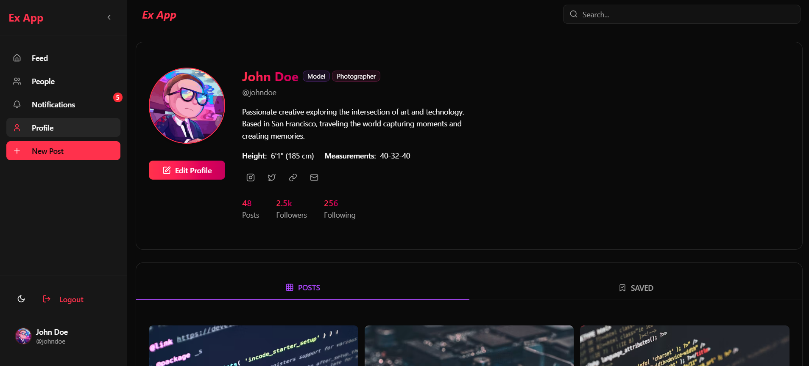

# ExFashion 🌟

## "Where Models Network, Collaborate, and Grow."

## 📱 Project Overview

ExFashion is a cutting-edge social media platform designed specifically for models, actors, and creative professionals in the entertainment and fashion industry. Our app provides a comprehensive networking and career development ecosystem.

### 🚀 Key Features

#### 1. Profile Management
- **Comprehensive Profile Creation**
- **Customizable Professional Titles**
  - Model
  - Actress/Actor
  - Director
  - Producer
  - Screenwriter
  - Cinematographer (DP)
  - And many more professional roles!

#### 2. Networking Capabilities
- Connect with industry professionals
- Find and collaborate with peers
- Expand professional network

#### 3. Portfolio Showcase
- High-quality image and video uploads
- Professional achievement tracking
- Dynamic portfolio gallery

#### 4. Professional Opportunities
- Gig Board with curated job listings
- Event discovery and RSVP
- Direct application features

### 🛠 Tech Stack

- **Frontend**: React.js
- **Backend**: Python Django 
- **Database**: My SQL
- **State Management**: Context , zustand
- **Authentication**:  Google OAuth
- **Storage**: C panel
- **Styling**: Tailwind CSS

### 🖥 Screenshots

*Sleek and intuitive login experience*

*Comprehensive profile showcase*

*Discover exciting professional opportunities*

### 🗺 User Journey

1. **Sign-Up/Login**
   - Quick social media or email registration
   - Guided profile setup wizard

2. **Profile Creation**
   - Upload professional photos
   - Select professional titles
   - Add bio and achievements

3. **Networking**
   - Search professionals
   - Send connection requests
   - Messaging system

4. **Opportunity Discovery**
   - Browse gig listings
   - Apply directly through app
   - Track application status

### 🔒 Security Features
- Secure user Authentication
- Profile verification process
- Content moderation

### 📈 Performance Optimization
- Lazy loading
- Code splitting
- Performance monitoring

### 🌐 Responsive Design
- Mobile-first approach
- Responsive layouts
- iOS and Android compatible

### 🤝 Contributing

### 📄 License
This project is licensed under the MIT License - see the [LICENSE.md](LICENSE.md) file for details.

### 💬 Support
For support, please email: support@exfashion.com

---

**Made with ❤️ by the ExMedia Team**